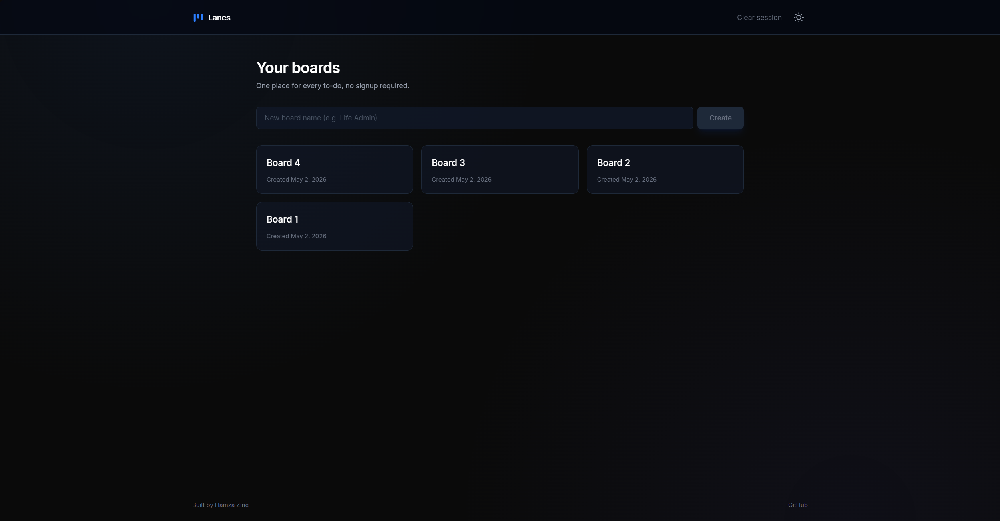
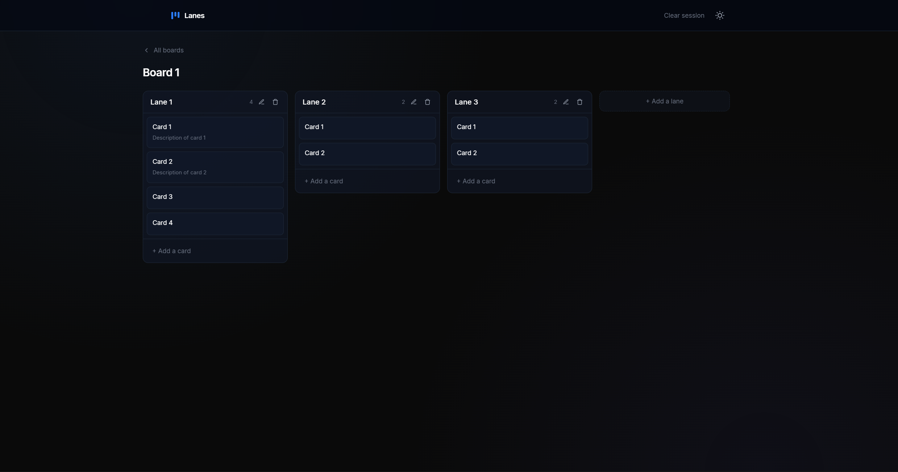
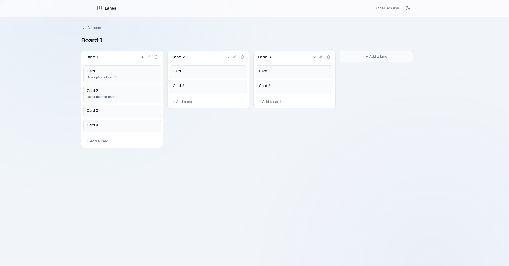

# Lanes

A minimalist kanban board with drag-and-drop, no signup, and a 30-day auto-expiring session — built end-to-end to demonstrate clean full-stack architecture across Spring Boot, Angular, and PostgreSQL.

[](https://lanes-web.onrender.com)
[](https://lanes-api.onrender.com)
[](https://spring.io/projects/spring-boot)
[](https://angular.dev)

## Live Demo

- **Web app:** https://lanes-web.onrender.com
- **API:** https://lanes-api.onrender.com

> First request after idle may take ~30 seconds — Render's free tier spins down inactive services.

## Screenshots

| | |
|---|---|
|  |  |
| Board list with session-scoped data | Drag-and-drop kanban view |

| |
|---|
|  |
| Light theme — auto-detects system preference |

## Stack

| Layer    | Technology                                              |
| -------- | ------------------------------------------------------- |
| Backend  | Java 17 · Spring Boot 4 · Spring Data JPA · Hibernate   |
| Database | PostgreSQL (production) · H2 in-memory (development)    |
| Frontend | Angular 21 (standalone, zoneless, signals) · Angular CDK |
| Styling  | Tailwind CSS v4 (class-based dark mode)                 |
| Hosting  | Render (free tier) · Containerized with Docker          |

## Features

### Core product
- **Multi-board workspaces** — each browser gets its own isolated workspace, boards listed newest-first
- **Custom lanes per board** — create, rename, reorder, and delete with full undo-free confidence (cascade-safe)
- **Cards with title and description** — inline editing, multi-line descriptions with preserved whitespace
- **Drag-and-drop everywhere** — cards within a lane, cards across lanes, whole lanes horizontally
- **Optimistic UI with server-side revert** — every drag feels instant; on API failure the UI snaps back to pre-move state

### Session model
- **Anonymous sessions** — no signup, no login. Every browser gets a UUID generated client-side on first visit and stored in `localStorage`
- **Session-scoped ownership** enforced at the repository layer — a request for session A literally cannot load data from session B; ownership is baked into the SQL query via derived method names like `findByIdAndLaneBoardSessionId`
- **30-day auto-expiry** — a scheduled job at 3 AM daily deletes sessions inactive for 30+ days and cascades through Session → Board → Lane → Card
- **Clear session button** — one-click reset that wipes `localStorage` and reloads; lets demo visitors try the app and revert to a clean slate
- **Session touch on every request** — `lastSeenAt` updated on each API call via a servlet filter, feeding the cleanup job

### UX polish
- **Light/dark theme** — auto-detects `prefers-color-scheme` on first visit, then respects user choice via a toggle in the header
- **FOUC-prevention script** — a tiny inline script in `index.html` applies the `.dark` class before Angular bootstraps, so the theme is correct on first paint
- **Inline rename and delete** — editing happens in-place, delete requires a flip-in-place confirmation (no jarring modals)
- **Empty states with icons** — board list, empty board, and loading states all get a custom illustration and helpful copy
- **Cold-start-aware loading UI** — the spinner explicitly mentions the 30-second cold start on free-tier Render, so users don't abandon
- **Hover-reveal actions** — pencil and trash icons fade in on card/board hover, keeping the default state clean
- **Subtle entrance animations** — fade-in and fade-up keyframes on initial render
- **Branded favicon** — custom SVG matching the three-bar logo, works crisp in both themes

### Engineering
- **Zoneless change detection** — no Zone.js polyfill, all state via `signal()`, `computed()`, and `effect()`
- **Reactive form validation** with inline error messages and maxLength caps matching server-side DTO constraints
- **HTTP interceptor for session header** — every `/api` request auto-gets `X-Session-Id` injected without controllers caring
- **Type-safe API layer** — backend DTOs and frontend TypeScript interfaces mirror each other 1:1
- **JVM-tuned Docker image** for low-memory deployment — runs comfortably on Render's 512 MB free tier

## API Reference

All `/api/**` endpoints require an `X-Session-Id: <uuid>` header. The frontend generates and stores this on first visit; for manual testing (Postman, `curl`) supply any valid UUID.

| Method   | Endpoint                      | Description                                                    |
| -------- | ----------------------------- | -------------------------------------------------------------- |
| `GET`    | `/api/boards`                 | List the current session's boards, newest first                |
| `POST`   | `/api/boards`                 | Create a board                                                 |
| `GET`    | `/api/boards/{id}`            | Get a board with lanes and cards nested in order               |
| `PATCH`  | `/api/boards/{id}`            | Rename a board                                                 |
| `DELETE` | `/api/boards/{id}`            | Delete a board (cascades to lanes and cards)                   |
| `POST`   | `/api/boards/{boardId}/lanes` | Add a lane to a board                                          |
| `PATCH`  | `/api/lanes/{id}`             | Rename or reorder a lane (`{name?, position?}`)                |
| `DELETE` | `/api/lanes/{id}`             | Delete a lane (cascades to its cards)                          |
| `POST`   | `/api/lanes/{laneId}/cards`   | Add a card to a lane                                           |
| `PATCH`  | `/api/cards/{id}`             | Update title/description or move (`{laneId?, position?, ...}`) |
| `DELETE` | `/api/cards/{id}`             | Delete a card                                                  |
| `GET`    | `/health`                     | Unauthenticated health check — useful for uptime monitors      |

### Example

```bash
SESSION=$(uuidgen)

# Create a board
curl -X POST https://lanes-api.onrender.com/api/boards \
  -H "Content-Type: application/json" \
  -H "X-Session-Id: $SESSION" \
  -d '{"name":"Sprint 12"}'

# Move a card to a different lane at a specific position
curl -X PATCH https://lanes-api.onrender.com/api/cards/42 \
  -H "Content-Type: application/json" \
  -H "X-Session-Id: $SESSION" \
  -d '{"laneId": 7, "position": 0}'
```

### Error responses

| Status | Scenario |
|---|---|
| `400` | Missing/invalid `X-Session-Id`, validation failure, cross-board card move |
| `404` | Resource not found in the current session (same response for "doesn't exist" and "not yours" — prevents enumeration) |

## Architecture Notes

### Backend

- **Session-scoped ownership at the repository layer.** Queries like `findByIdAndLaneBoardSessionId(cardId, sessionId)` bake ownership into the SQL. No controller-level permission check needed — a request for session A simply cannot load data from session B. This is stronger than any in-memory authorization check because it's enforced at the database query level.

- **Position as an integer, reindexed on every move.** Simpler than LexoRank / fractional positions, deterministic, and O(n) on cards-per-lane, which is fine for kanban-sized data (<100 cards per lane). Every move triggers a reindex of the affected lane(s) so positions stay contiguous. Trade-off is accepted: more writes per move, but cleaner reads and trivial ordering logic.

- **Two-phase design with explicit `@OrderBy`.** `List<Lane>` and `List<Card>` collections use `@OrderBy("position ASC")` so the ORM always returns children in the correct order. The service layer never has to sort manually.

- **Cross-board card moves explicitly blocked** with `IllegalArgumentException` — a user dragging a card within their own board can't accidentally move it to another board via a crafted API call. The service-layer guard is redundant with the repository-layer session check but provides defense-in-depth and a clearer error.

- **Scheduled cleanup via JPA cascade, not bulk DELETE.** The daily 3 AM job loads stale `Session` entities and deletes them through `sessionRepository.deleteAll(stale)`. JPA cascades through Session → Board → Lane → Card thanks to `cascade = ALL` + `orphanRemoval = true` on the parent sides. Slightly slower than a bulk DELETE, but leaves no orphaned rows and runs when the DB is idle anyway.

- **Session touch throttled at 1-minute granularity could be added** as a future optimization — currently every request writes `lastSeenAt`. At current demo scale this is negligible.

- **Servlet filter + request-scoped bean for the session ID.** `SessionFilter` extracts and validates `X-Session-Id`, populates a `@RequestScope` `SessionContext` bean, and touches the session. Services inject the scoped proxy and read `sessionContext.getSessionId()` — no thread-locals, no parameter plumbing through every method.

- **CORS filter registered at `HIGHEST_PRECEDENCE`** so preflight `OPTIONS` requests get proper CORS headers *before* hitting the session filter (which would otherwise reject them for missing `X-Session-Id`).

- **Multi-stage Dockerfile.** JDK for the Maven build stage, JRE-only for the runtime stage. Smaller final image and faster cold starts.

- **JVM-tuned for small containers.** `-XX:MaxRAMPercentage=75.0 -XX:+UseSerialGC -Xss512k -Dspring.jmx.enabled=false -Dserver.tomcat.threads.max=20`. Standard production tuning for 512 MB-class deployments; without this the app OOM-crashes on Render's free tier before it finishes booting.

- **Profile-based configuration** in `application.yml`. Dev profile uses H2 in-memory with the console enabled; prod uses PostgreSQL with the console disabled. A single `SPRING_PROFILES_ACTIVE=prod` env var flips the whole stack.

### Frontend

- **Zoneless change detection with Signals.** `provideZonelessChangeDetection()` in `app.config.ts`, all state via `signal()`/`computed()`. Change detection is driven by signal writes, which makes the drag-drop flow deterministic and removes the Zone.js polyfill from the bundle.

- **Optimistic UI with snapshot-and-revert.** Every drag clones the current board state via `structuredClone()` before mutating. The mutation is applied locally (new lane/card positions computed and the `board` signal updated with a fresh reference), then the PATCH fires in the background. On error, the snapshot is restored. Makes the app feel instant on localhost and graceful on cold backends.

- **Two-level CDK drag-drop.** A horizontal `cdkDropList` holds all lanes; each lane contains a vertical `cdkDropList` for its cards. The card drop lists are connected to each other via `[cdkDropListConnectedTo]="laneIds()"`, where `laneIds` is a `computed()` signal deriving IDs like `lane-123` from the board state. The lanes drop list is deliberately not connected to card drop lists, so you can't accidentally drop a card onto the lanes row.

- **HTTP interceptor for session headers.** `sessionInterceptor` inspects every outgoing request; if the URL starts with the configured API base, it attaches `X-Session-Id` from `SessionService`. Components never touch the header.

- **Session UUID generation with validation.** `SessionService` generates via `crypto.randomUUID()` on first visit and stores in `localStorage`. On subsequent loads, the stored value is validated against a UUID regex before use — a tampered or corrupted value triggers a fresh UUID.

- **Tailwind v4 class-based dark mode.** Uses the `@custom-variant dark (&:where(.dark, .dark *))` directive in `styles.css`. The `ThemeService` toggles a `.dark` class on `<html>` and persists the choice in `localStorage`.

- **FOUC-prevention script.** An inline `<script>` in `index.html` reads the stored theme (or falls back to `prefers-color-scheme`) and applies the `.dark` class **before** Angular bootstraps. Eliminates the flash of wrong theme on first paint.

- **Smart short-code-style input parsing** in flexible places (e.g. accepting either a bare board ID or a full URL path segment) — keeps manual URL typing forgiving.

- **SPA routing fallback** via `public/_redirects` (`/*    /index.html   200`). Render's static host serves `index.html` for any unmatched path, letting the Angular router handle deep links like `/boards/42`.

- **Environment-based API URL switching.** `environment.development.ts` points to `http://localhost:8080`, `environment.ts` to the live Render API. Angular's build targets pick the right file automatically.

## Run Locally

### Prerequisites

- JDK 17+
- Node.js 20+
- Maven (or use the included `./mvnw` wrapper)

### Backend

```bash
cd lanes-backend
./mvnw spring-boot:run
```

API available at `http://localhost:8080` with the H2 console at `/h2-console` (dev profile).

### Frontend

```bash
cd lanes-frontend
npm install
ng serve
```

App available at `http://localhost:4200`.

### Configuration

| Env var | Default | Description |
|---|---|---|
| `SPRING_PROFILES_ACTIVE` | `dev` | `dev` uses H2 in-memory, `prod` uses PostgreSQL |
| `SPRING_DATASOURCE_URL` | — | Full JDBC URL (prod only) |
| `SPRING_DATASOURCE_USERNAME` | — | DB user (prod only) |
| `SPRING_DATASOURCE_PASSWORD` | — | DB password (prod only) |
| `CORS_ALLOWED_ORIGINS` | `http://localhost:4200` | Comma-separated allowed origins |
| `PORT` | `8080` | Set by Render; overrides `server.port` |
| `app.session.cleanup-after-days` | `30` | Days of inactivity before cleanup deletes a session |

## Project Structure

```
lanes/
├── lanes-backend/                 Spring Boot backend
│   ├── src/main/java/com/hamzazine/lanes/
│   │   ├── controller/            REST endpoints (Board, Lane, Card, Health)
│   │   ├── service/               Business logic + scheduled cleanup + DTO mapper
│   │   ├── session/               Session context, filter, touch service
│   │   ├── entity/                JPA entities (Session, Board, Lane, Card)
│   │   ├── repository/            Spring Data repositories with derived ownership queries
│   │   ├── dto/                   Request/response records with validation
│   │   ├── exception/             NotFoundException + global handler
│   │   └── config/                CORS filter (HIGHEST_PRECEDENCE)
│   ├── Dockerfile                 Multi-stage build with JVM tuning
│   └── src/main/resources/
│       └── application.yml        Dev/prod profiles
└── lanes-frontend/                Angular frontend
    └── src/
        ├── app/
        │   ├── components/
        │   │   ├── board-list/    Board grid, create, rename, delete
        │   │   └── board-detail/  Drag-and-drop kanban view
        │   ├── services/          API client, session UUID, theme toggle
        │   ├── interceptors/      Session header injection
        │   └── models/            TypeScript API types
        ├── environments/          Dev/prod API URL switching
        ├── public/
        │   ├── _redirects         SPA routing fallback for Render
        │   └── favicon.svg        Custom branded icon
        └── index.html             FOUC-prevention script + meta tags
```

## Deployment

Both services are deployed on Render's free tier:

- **Backend:** Web Service (Docker runtime), connects to a shared PostgreSQL instance
- **Frontend:** Static Site (built with `ng build`, served from `dist/lanes-frontend/browser`)
- **Routing:** SPA fallback via `_redirects` so deep links to `/boards/:id` resolve correctly
- **CORS:** configured via `CORS_ALLOWED_ORIGINS` env var on the backend, containing both local dev and prod frontend origins (comma-separated)
- **Database:** the Postgres instance is shared with another project on the same account (Render's free tier limits accounts to one active PostgreSQL instance) — no table conflicts since Lanes uses its own `sessions`, `boards`, `lanes`, and `cards` tables

## Possible Improvements

### Real-time and collaboration
- **Live collaboration via WebSockets** — multiple browsers on the same session (or an invited link) see drag-drop updates in real time
- **Shareable read-only board links** — public URL that renders the board without edit affordances
- **Presence indicators** — show which session is currently viewing a board

### Card features
- **Labels/tags** with color coding and filter-by-label
- **Due dates** with overdue highlighting and a calendar icon
- **Checklists** within cards (percentage complete shown on the card face)
- **File attachments** (images, PDFs) via a blob store
- **Markdown rendering** in card descriptions

### Board features
- **Board templates** — "Agile Sprint", "Weekly Planner", "Bug Triage" starting points
- **Board archive** — soft-delete instead of hard-delete, restore from a "trashed boards" view
- **Import/export a board as JSON** — useful for backup or moving between sessions
- **Search across all boards** in the current session
- **Filter and sort** within a board (by label, due date, etc.)

### Workflow and power-user
- **Keyboard shortcuts** — `c` for new card, `j`/`k` for navigating cards, `/` for search, `Esc` to cancel
- **Bulk operations** — select multiple cards, move them en masse, delete them together
- **Undo/redo stack** for destructive operations (delete, move)
- **Recent activity feed** per board — "Card X moved from To Do to In Progress 3 minutes ago"
- **Cycle-time analytics** — how long cards typically sit in each lane (Little's law for teams)

### Backend hardening
- **Rate limiting per session** on write endpoints (bucket4j)
- **Optional API key authentication** for programmatic access outside the browser
- **Testcontainers-based integration tests** that spin up real PostgreSQL during CI instead of relying on H2
- **LexoRank-style fractional positions** if board scale grows beyond kanban (thousands of cards per lane)
- **Session-touch throttling** (only update `lastSeenAt` if more than 1 minute stale) to reduce DB write amplification
- **Background audit log** of moves for debugging and analytics

### Frontend polish
- **Accessibility audit** — full ARIA coverage for drag-drop announcements, keyboard-only drag-drop via CDK's keyboard accessibility features
- **Live theme sync** — currently the theme is locked on first load; follow system preference changes in real time
- **Offline-first** via a service worker that queues mutations while offline and syncs on reconnect
- **Progressive Web App** — installable, standalone window mode
- **Animated card transitions** — cards fly from source to destination on cross-lane moves instead of jumping

### DevOps
- **Separate dedicated PostgreSQL** instance (via Neon / Supabase) instead of sharing with another portfolio project
- **Render preview environments** on PRs for visual review
- **Bundle-size monitoring** on CI to catch regressions
- **Error reporting** via Sentry or similar

## Author

Built by [Hamza Zine](https://github.com/HamZa2108).
